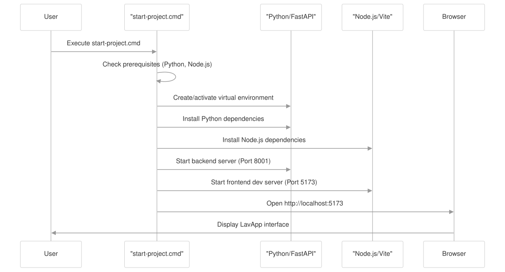

# LavApp Project


[](https://deepwiki.com/Biltzaile/LavAppProject)

LavApp is a comprehensive vehicle washing service management system designed to streamline operations for car wash businesses.

## Table of Contents
- [LavApp Project](#lavapp-project)
  - [Table of Contents](#table-of-contents)
  - [System Purpose and Scope](#system-purpose-and-scope)
  - [System Architecture](#system-architecture)
    - [Frontend Architecture](#frontend-architecture)
    - [Backend Architecture](#backend-architecture)
    - [Data Storage](#data-storage)
    - [Role-Based Access Control](#role-based-access-control)
  - [Key Business Process: Invoice Creation](#key-business-process-invoice-creation)
  - [System Configuration](#system-configuration)
  - [Development \& Getting Started](#development--getting-started)
    - [Prerequisites](#prerequisites)
    - [Installation and Setup](#installation-and-setup)
      - [1. Clone the Repository](#1-clone-the-repository)
      - [2. Automated Setup with start-project.cmd](#2-automated-setup-with-start-projectcmd)
      - [3. Manual Setup](#3-manual-setup)
        - [Backend Setup](#backend-setup)
        - [Frontend Setup](#frontend-setup)
    - [Configuration](#configuration)
      - [Backend Configuration](#backend-configuration)
      - [Frontend Configuration](#frontend-configuration)
    - [Accessing the Application](#accessing-the-application)
    - [Development Workflow](#development-workflow)
  - [Troubleshooting](#troubleshooting)
  - [Next Steps](#next-steps)

## System Purpose and Scope
LavApp enables businesses to manage:
- Clients and their vehicles
- Washing services and pricing
- Invoicing and payment processing
- Promotions and discounts
- User accounts with role-based access
- Business reporting and analytics
- System configuration

## System Architecture
LavApp follows a client-server architecture with a React frontend and FastAPI backend, using CSV files for data persistence.



The system is started through a unified script that launches both frontend and backend components, facilitating development and testing.

> Need more details? See the <a href="https://deepwiki.com/Biltzaile/LavAppProject" target="_blank">DeepWiki documentation</a> for in-depth guides and diagrams.

### Frontend Architecture
The frontend is built with React and implements protected routes based on user roles, with dedicated pages for each business function.



The frontend implements custom stores for state management, handling authentication, application settings, and service data.

### Backend Architecture
The backend is built with FastAPI and follows a Controller-Service-Model architecture pattern.



The backend exposes a RESTful API with controllers responsible for handling HTTP requests, services implementing business logic, and direct CSV file access for data persistence.

### Data Storage
LavApp uses a simple but effective file-based storage approach with CSV files for most data entities and JSON for configuration:

| **File** | **Purpose** |
| --- | --- |
| usuarios.csv | User accounts with roles (ADMINISTRADOR, POS, SOPORTE) |
| facturas.csv | Invoice records with services, client and vehicle data |
| servicios_generales.csv | General services applicable to all vehicles |
| servicios_adicionales.csv | Additional services with vehicle-specific pricing |
| promociones.csv | Discount promotions |
| config.json | System configuration including company info and theme |

This approach provides simplicity and portability without requiring a dedicated database server.

### Role-Based Access Control
LavApp implements a role-based security model with three primary user roles:
- **ADMINISTRADOR**: Full access to all system functions
- **POS** (Point of Sale): Can manage clients, vehicles, and create invoices
- **SOPORTE**: Technical access for system maintenance

## Key Business Process: Invoice Creation
A key business process in LavApp is the creation of invoices for vehicle washing services. This workflow demonstrates how the frontend and backend components collaborate to create an invoice, from initial data entry to final receipt generation.

## System Configuration
LavApp includes a flexible configuration system that allows customization of business details and application appearance:

```json
{
    "empresa": {
        "nombre": "LavApp",
        "nit": "1234567890",
        "telefono": "6042223243",
        "direccion": "Cl 30 # 34-45",
        "iva": true,
        "valor_iva": 19.0,
        "iva_incluido": true,
        "logo": "data:image/png;base64,..."
    },
    "tema": {
        "primario": "242 80% 30%",
        "foregroundPrimario": "0 0% 100%"
    }
}
```

The system stores company information (name, tax ID, address), tax configuration, and theming preferences in the configuration file.

## Development & Getting Started

### Prerequisites
Before starting, ensure you have the following installed on your system:

| **Requirement** | **Version** | **Notes** |
| --- | --- | --- |
| Python | 3.x | Required for the backend FastAPI application |
| Node.js | 16+ recommended | Required for the frontend React application |
| Git | Any recent version | For version control and correct line endings |

### Installation and Setup
#### 1. Clone the Repository
```bash
 git clone https://github.com/Biltzaile/LavAppProject.git
 cd LavAppProject
```
#### 2. Automated Setup with start-project.cmd

```powershell
start-project.cmd
```
The script will:
1. Verify that Python and Node.js are installed
2. Set up a Python virtual environment in the backend directory
3. Install backend dependencies from `requirements.txt`
4. Install frontend dependencies using npm
5. Start the backend server on port 8001
6. Start the frontend development server on port 5173
7. Open the application in your default browser

#### 3. Manual Setup
If you prefer to set up the components manually, or if you're using a non-Windows system, follow these steps:

##### Backend Setup
```bash
cd backend
python -m venv venv
# On Windows:
venv\Scripts\activate
# On Unix/MacOS:
source venv/bin/activate
pip install -r requirements.txt
python main.py
```
##### Frontend Setup
```bash
cd frontend
npm install
npm run dev
```

> For step-by-step guides and advanced configuration, see <a href="https://deepwiki.com/Biltzaile/LavAppProject" target="_blank">DeepWiki</a>.

### Configuration
#### Backend Configuration
The backend runs on `127.0.0.1:8001` by default. This is configured in the `main.py` file:
```python
uvicorn.run("main:app", host="127.0.0.1", port=8001, reload=True)
```
CORS is enabled for development, allowing requests from any origin. In a production environment, you should restrict the allowed origins to specific domains.

#### Frontend Configuration
The frontend connects to the backend using the API URL specified in the `.env` file:
```env
VITE_API_URL=http://127.0.0.1:8001/api
```
This environment variable is used in the Axios configuration to set the base URL for API requests.

### Accessing the Application
Once both the backend and frontend servers are running:
1. The FastAPI backend will be available at: [http://127.0.0.1:8001](http://127.0.0.1:8001/)
2. The API documentation (Swagger UI) will be available at: [http://127.0.0.1:8001/docs](http://127.0.0.1:8001/docs)
3. The React frontend will be available at: [http://localhost:5173](http://localhost:5173/)

### Development Workflow

- **Frontend**: The Vite dev server provides hot module replacement, so changes to frontend code will be immediately reflected in the browser without a full page reload.
- **Backend**: The Uvicorn server is started with `reload=True`, which automatically reloads the server when Python files are changed.

## Troubleshooting
The troubleshooting guide is available in the [project Wiki](https://github.com/Biltzaile/LavAppProject/wiki/Troubleshooting).

## Next Steps
- Docker Compose for production
- Migrate CSV → PostgreSQL
- Tests (pytest / RTL) and CI (GitHub Actions)

> Explore more business processes and technical details in the <a href="https://deepwiki.com/Biltzaile/LavAppProject" target="_blank">DeepWiki documentation</a>.